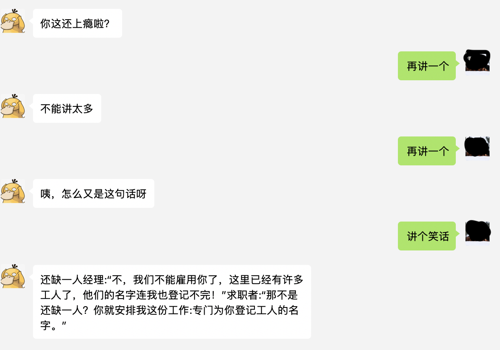

# 部署
## 新建用户
一般不使用root 权限部署应用
```
useradd www-deploy
passwd www-deploy
visudo
# 加入
www-deploy ALL(ALL) ALL,!/usr/bin/passwd root 
su www-deploy
```
## 安装python3
```
sudo yum install gcc openssl openssl-devel
wget https://www.python.org/ftp/python/3.7.1/Python-3.7.1.tgz
tar -zxvf Python-3.7.1.tgz 
cd Python-3.7.1/
cd Modules/
vim Setup.dist
# 添加以下内容启动ssl
_socket socketmodule.c
# Socket module helper for SSL support; you must comment out the other
# socket line above, and possibly edit the SSL variable:
#SSL=/usr/local/ssl
_ssl _ssl.c \
 -DUSE_SSL -I$(SSL)/include -I$(SSL)/include/openssl \
 -L$(SSL)/lib -lssl -lcrypto

------------------
./configure
make 
sudo make install 
```
## 安装supervisor
```
pip install supervisor
echo_supervisord_conf > supervisor.conf
sudo mkdir /var/log/supervisor
```
## 源码部署
```
git clone https://github.com/TheFifthMan/wechatbot.git
cd wechatbot 
python -m venv venv
source venv/bin/activate
pip install -r requirements.txt
```
## 环境变量
基本上就是config.py里面需要的值，目前简单配置微信公众号需要的几个key
```
WECHAT_TOKEN=xxxx
AES_KEY=xxxxx
APPID=xxxx
TULING_APIKEY=xxxxx
```
## 传输配置文件
```
scp -P <your-ssh-port> .env www-deploy@<yourIP>:./www/wechatbot
scp -P <your-ssh-port> wechatbot.conf www-deploy@<yourIP>:./www/config/
```
## wechatbot.conf
```
[program:wechatbot]
command=/home/www-deploy/www/wechatbot/bin/gunicorn - b localhost:8000 -w 4 run:app
directory=/home/www-data/www/wechatbot
user=www-data
autostart=true
autorestart=true
stopasgroup=true
killasgroup=true
stdout_logfile = /var/log/supervisor/wechatbot.log
stderr_logfile = /var/log/supervisor/wechatbot_err.log
redirect_stderr = true
startsecs = 3
environment = LC_ALL="en_US.UTF-8
```
## 启动服务
这里启动主要使用的是
```
gunicorn - b localhost:8000 -w 4 run:app
```
-b 高数 gunicorn 监听的地址和端口
-w 启动几个woker，并发处理服务
run:app run 指的是启动脚本 app 指的是我们这个application的名字，我们取名为了app
## 管理supervisor
通过supervosirctl 管理进程
```
supervisorctl -c supervisor.conf 
```
然后就会进入shell交互
```
status： 查看管理的app状态
reload： 更改了supervisor.conf 重新载入
remove appname：移除管理的program
reread： 重新读取配置
add program： 添加program并启动
```

## 安装openresty+反向代理
```
# 安装依赖
sudo yum install pcre-devel openssl-devel gcc curl gcc-gcc-c++ -y
# 请自行到下载页面下载： https://openresty.org/cn/download.html 
wget https://openresty.org/download/openresty-1.13.6.2.tar.gz
# 安装 
./configure --prefix=/usr/local/openresty-1.13.6.2 \
--with-luajit --with-http_stub_status_module \
--with-pcre=/usr/local/src/pcre-8.41 --with-pcre-jit
# 下载pcre，主要为了后面要设置防火墙的时候使用
cd /usr/local/src
sudo wget ftp://ftp.csx.cam.ac.uk/pub/software/programming/pcre/pcre-8.41.tar.gz 
sudo tar -zxvf pcre-8.41.tar.gz
# 安装openresty
sudo gmake && gmake install
# 进入nginx
cd /usr/local/openresty-1.13.6.2/nginx
sudo ./sbin/nginx -c conf/nginx.conf
```
现在输入你的服务器地址，应该可以看到nginx的欢迎界面了，接下来，我们需要设置以下反向代理
```
# 在conf文件下添加wechatbot.conf
upstream supervisor {
    server 127.0.0.1:8000;
}
server {
    listen 80;
    server_name <your IP>;
    location / {
        proxy_pass http://supervisor;
    }
}
```
在nginx.conf 倒数第二行添加
```
http:{
  ...
  # 将server 相关配置注释掉
  include "/usr/local/openresty-1.13.6.2/nginx/conf/wechatbot.conf";
}
```
重启nginx
```
./sbin/nginx -s reload
```
输入你的IP，可以看到
```
Server Up message
```
最后将 http://<yourIP>/wechat 填入微信公众号即可。

# screenshot
